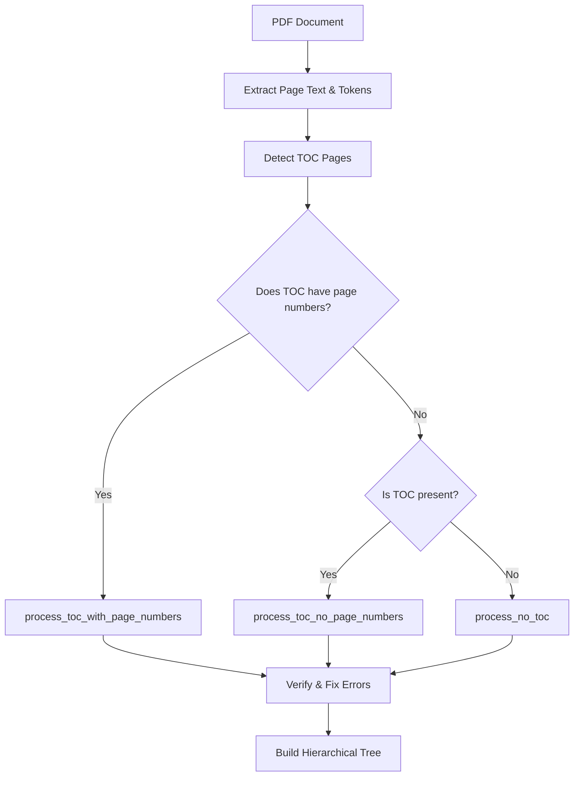

# PageIndex Algorithm Explanation

## Overview

The [`page_index.py`](pageindex/page_index.py) file implements a **Table of Contents (TOC) extraction and page indexing system** for PDF documents. It analyzes PDFs to extract hierarchical structure (chapters, sections, subsections) and maps each section to its physical page location.

---

## Processing Flow



---

## Core Algorithms

### 1. TOC Detection ([`find_toc_pages()`](pageindex/page_index.py:333))
- Iterates through pages starting from a given index
- Uses LLM to detect if each page contains a Table of Contents
- Returns list of page indices where TOC is found

### 2. Three Processing Modes

| Mode | Function | Use Case |
|------|----------|----------|
| **process_toc_with_page_numbers** | [`process_toc_with_page_numbers()`](pageindex/page_index.py:614) | TOC has page numbers - uses offset calculation |
| **process_toc_no_page_numbers** | [`process_toc_no_page_numbers()`](pageindex/page_index.py:589) | TOC exists but no page numbers |
| **process_no_toc** | [`process_no_toc()`](pageindex/page_index.py:568) | No TOC - extracts structure from content |

### 3. Page Offset Calculation ([`calculate_page_offset()`](pageindex/page_index.py:386))
When TOC has page numbers that don't match actual pages:
- Compares TOC page numbers with actual physical indices
- Calculates the difference (offset) between them
- Uses the most common difference to correct all page references

```python
# Example:
# TOC says "Chapter 1" is on page 10
# Actually found on physical page 15
# Offset = 15 - 10 = 5
# Apply offset to all TOC entries
```

### 4. Content Grouping ([`page_list_to_group_text()`](pageindex/page_index.py:418))
- Splits large documents into token-limited chunks (~20,000 tokens)
- Allows processing of very large PDFs that exceed LLM context limits
- Maintains overlap between chunks for continuity

### 5. Verification & Error Correction

- **[`verify_toc()`](pageindex/page_index.py:892)**: Samples random sections and verifies they appear on the claimed page
- **[`fix_incorrect_toc()`](pageindex/page_index.py:752)**: For incorrect page mappings, finds the correct page by searching within a range
- Uses async concurrent processing for efficiency

---

## Key Data Structures

### Input: List of pages with text and token counts
```python
page_list = [
    (page_text, token_count),
    (page_text, token_count),
    ...
]
```

### Output: Hierarchical tree with structure indices
```python
[
    {
        "structure": "1",
        "title": "Introduction",
        "physical_index": 1,
        "nodes": [
            {"structure": "1.1", "title": "Background", "physical_index": 3},
            {"structure": "1.2", "title": "Objectives", "physical_index": 7}
        ]
    },
    {
        "structure": "2", 
        "title": "Literature Review",
        "physical_index": 15
    }
]
```

---

## Physical Index Tagging

The algorithm wraps each page with special tags for LLM processing:

```text
<physical_index_1>
[Page 1 content here...]
<physical_index_1>
```

This allows the LLM to identify exactly which page a section starts on.

---

## Error Handling Strategy

1. **Validation**: Removes page indices that exceed document length
2. **Verification**: Checks accuracy via random sampling
3. **Retries**: Attempts to fix incorrect mappings up to 3 times
4. **Fallback**: If accuracy < 60%, tries simpler processing modes

---

## Entry Points

- **[`page_index_main()`](pageindex/page_index.py:1058)**: Main async orchestrator
- **[`page_index()`](pageindex/page_index.py:1103)**: Public API with configurable parameters
- **[`tree_parser()`](pageindex/page_index.py:1021)**: Core parsing logic

---

## Summary

This is an **AI-powered document structuring system** that:

1. Detects whether a PDF has a Table of Contents
2. Extracts or generates the hierarchical structure
3. Maps each section to its actual page location
4. Verifies accuracy and corrects errors
5. Builds a navigable tree structure for the document

The algorithm uses LLMs for intelligent extraction but also implements traditional algorithms (offset calculation, validation) to ensure accuracy.
